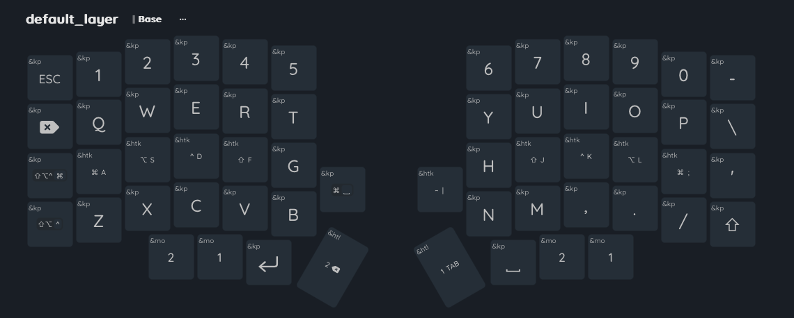
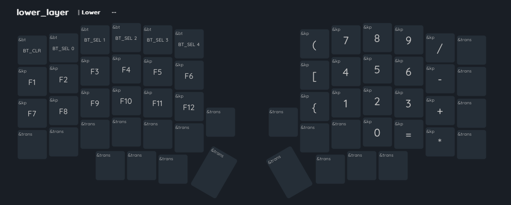
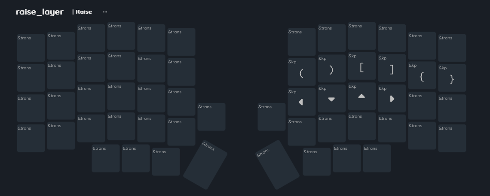

# Initial ZMK Config for my Lily58 from Typeractive.xyz

## Homerow mods, Hold-Tap, Momentary Layers

GACS/◆⎇⎈⇧ keys as my primary modifiers, A CMD, S ALT, D CTRL, F SHIFT and J SHIFT, K CTRL, L ALT, ; CMD 
Other Hold-Tap RET Raise, TAB Lower, PIPE TILDE

